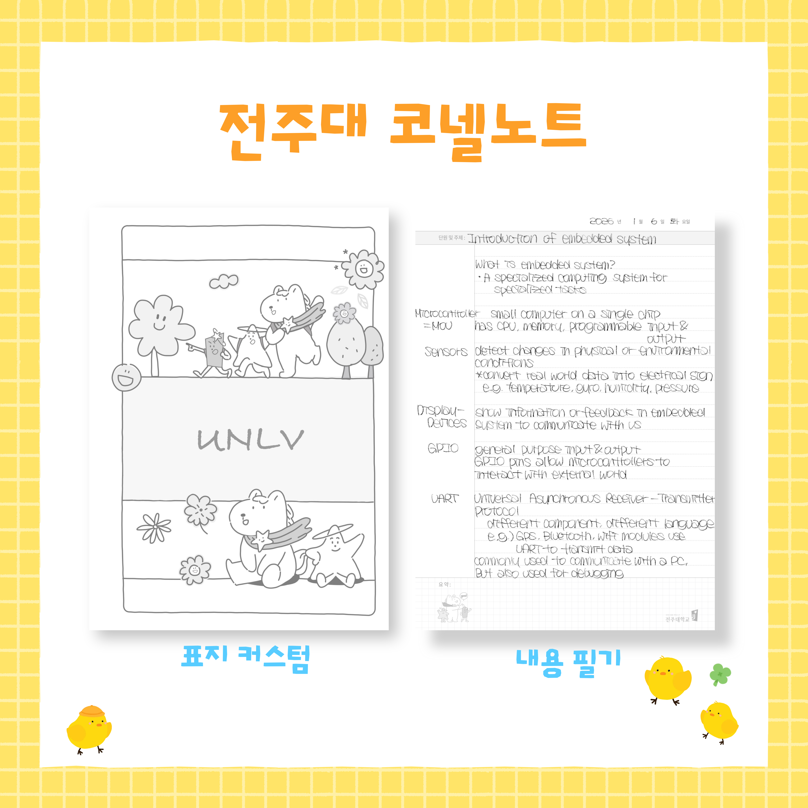

# [전주대 학습법 노하우] 코넬노트로 공부하는 방법 (아이패드 필기 꿀팁)

안녕하세요 :)
전주대학교 학습법 노하우 경진대회에 참여하게 된 김영은입니다!

이번 글은 1주차 주제인
학습법 노하우 경진대회 신청 이유, 목표 및 계획, 그리고 소감에 대해
제가 실제로 공부하면서 사용했던 방법과 함께 풀어보려고 합니다.

사실 저는 공부를 엄청 잘하는 스타일이라기보다는,
“어떻게 해야 효율적으로 할 수 있을까?”를 계속 고민해온 케이스에 가까워요.

그렇게 4년 동안 시행착오를 겪으면서
장학금도 약 천만 원 정도 받았고,
해외 교환학생도 총 4번 다녀오게 되었습니다.

그래서 이번 글은
조금은 현실적인, 대신 실제로 효과 있었던 방법을 공유하는 느낌으로
편하게 읽어주시면 좋을 것 같아요!

---

## 1. 학습법 노하우 경진대회 신청하게 된 이유

이 대회를 알게 됐을 때 제일 먼저 들었던 생각은
“이거 그냥 과제가 아니라, 진짜 정리할 기회다”였어요.

그동안 공부하면서
필기 방법도 바꿔보고, 계획 세우는 방식도 바꿔보고,
시간 관리도 여러 번 실패해보면서
나름대로 저한테 맞는 방법을 찾았거든요.

근데 막상 누가 “너 공부 어떻게 해?”라고 물어보면
딱 정리해서 설명하기가 어렵더라고요.

그래서 이번 기회에
✔ 내가 어떤 방식으로 공부하는지
✔ 왜 그 방법이 나한테 맞는지
✔ 실제로 어떤 효과가 있었는지

이걸 한 번 제대로 정리해보고 싶었습니다.

그리고 솔직히,
저도 처음에는 공부 방법 때문에 엄청 헤맸던 사람이라
비슷하게 고민하는 분들한테
조금이라도 도움이 되면 좋겠다는 생각도 컸어요.

---

2. 목표 1가지와 목표에 따른 계획

이번 활동에서 제 목표는 하나로 잡았습니다.

👉 “내 공부법을 누구나 따라할 수 있게 구체화하기”

단순히 “이거 좋아요”가 아니라
“이렇게 하면 됩니다”까지 보여주는 게 목표입니다.

그래서 저는 매 포스팅마다 다음 3가지는 꼭 넣을 계획이에요.

1. 실제 사용 방법 (과정 중심 설명)
2. 내가 이렇게 하는 이유
3. 적용했을 때 느낀 변화

특히 이번 글에서는
제가 가장 오래 유지하고 있는 공부법인
**코넬노트 필기법**을 중심으로 설명하려고 합니다.

---

## 3. 내가 사용하는 코넬노트 (아이패드 + 프로크리에이트)

코넬노트는 전주대 온스타에서 신청하면
재학생이라면 누구나 받을 수 있는 템플릿이에요.

저도 처음에는 그냥 기본 양식을 사용했는데,
쓰다 보니까 조금 불편한 부분이 있더라고요.

그래서 아이패드에서 프로크리에이트로
제 스타일에 맞게 직접 수정해서 사용하고 있습니다.

제가 수정한 부분은 

✔ 중간 표지 생성
→ 날짜별로 정리하기보단 과목별로 정리하는게 복습에 효과적

이렇게 바꿔주니까
단순히 필기하는 용도가 아니라
복습까지 연결되는 노트로 바뀌었습니다!

---

## 4. 코넬노트 실제 사용하는 방법

제가 코넬노트를 쓰는 방식은 생각보다 단순합니다.

✔ 1단계: 수업 중 필기 (오른쪽 영역)
그냥 받아 적는 게 아니라
“이게 왜 중요한지”를 생각하면서 적어요.

예를 들어
정의 → 바로 적기
예시 → 간단하게 요약
교수님 강조 → 표시

이렇게 구조를 잡아서 적습니다.

---

## ✔ 2단계: 키워드 정리 (왼쪽 영역)
이게 진짜 핵심입니다.

수업이 끝난 직후 또는 집에 와서
오른쪽 내용을 보면서
“이걸 한 단어로 줄이면 뭐지?”를 생각해서 적어요.

예를 들면

* overfitting
* gradient descent
* regularization

이렇게 키워드 중심으로 정리합니다.

이걸 해두면
시험 전에 왼쪽만 보고도
오른쪽 내용이 떠오르는 상태가 됩니다.

---

## ✔ 3단계: 하단 요약 (복습 단계)
이건 바로 안 쓰고
하루 뒤나 일주일 뒤에 씁니다.

“이 페이지를 한 문장으로 설명하면?”
이걸 기준으로 정리합니다.

이 과정이 중요한 이유는
단순 암기가 아니라
이해 기반으로 바뀌기 때문입니다.

---

## 5. 이 방법이 효과 있었던 이유

제가 이 방법을 계속 유지하는 이유는 명확합니다.

👉 복습이 ‘의식적으로’가 아니라 ‘구조적으로’ 이루어짐

보통은 
필기 → 끝 → 시험 전에 몰아서 보기 
이 흐름인데 

코넬노트는 
필기 → 키워드 → 요약 
이 과정 자체가 복습입니다. 

그래서 따로 복습 시간을 많이 들이지 않아도
기억이 오래 남는다는 장점이 있습니다.

실제로
시험 직전에 전체를 다시 보지 않아도
키워드만 봐도 내용이 연결되는 경험을 많이 했습니다.

---

## 6. 학습법 노하우 경진대회에 임하는 소감

이번 활동은 단순히 글을 쓰는 게 아니라
제 공부 방식을 객관적으로 정리하는 과정이라고 생각합니다.

4년 동안 나름대로 쌓아온 방법들이 있지만
그걸 제대로 설명해본 적은 없어서
이번 기회를 통해 더 명확하게 정리해보고 싶어요.

앞으로 포스팅에서는 
✔ 실제 필기 사진 
✔ 시험기간 활용법 
✔ 시간 관리 방법 
✔ 과목별 공부 전략 

이런 부분들도 하나씩 풀어볼 예정입니다.

다음 글에서는
“시험기간에 코넬노트로 정리하는 방법”
조금 더 실전적으로 가져와볼게요 ✍️  

---  

#전주대학교 #전주대학교 학습법 #전주대학교 교수학습개발센터 #전주대 #전주대 
CTL #전주대 학습법 노하우 #전주대 경진대회 #전주대 대학생
